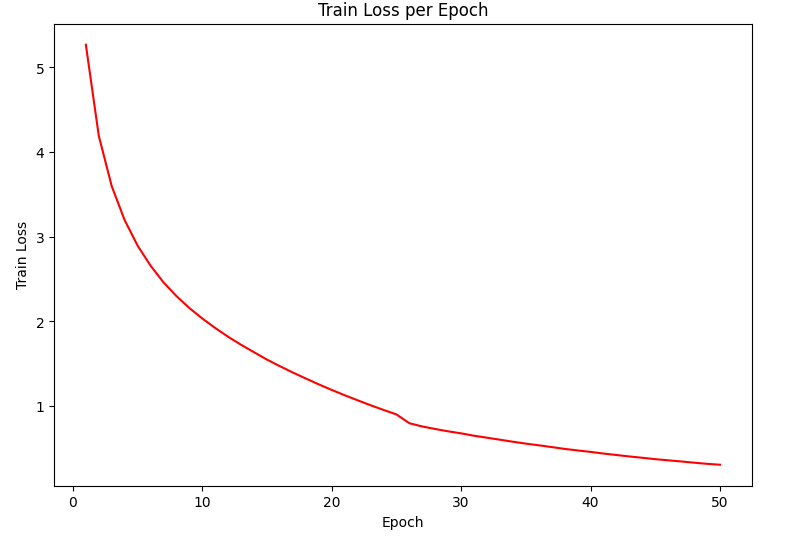

# Transformer-from-Scratch

This project implements the Transformer architecture from *"Attention Is All You Need"* and builds a training and inference pipeline for Neural Machine Translation.

## What I implemented

### Transformer Architecture
- Sinusoidal Positional Encoding
- Scaled Dot-Product Attention
- Multi-Head Attention
- Encoder Block
- Decoder Block
- Transformer Model

### Training Pipeline
- Multi30k English-German Translation Dataset
- Joint BPE Tokenization(Dependency on Hugging Face)
- Teacher Forcing Training
- Autoregressive Inference

### Experiment
- Translation inference examples
- Training loss visualization

## Key Idea

- Transformer removes recurrence and convolution, relying entirely on attention mechanisms.
- Positional Encoding provides sequence order information.
- Multi-head attention allows the model to capture different representation subspaces.

## Results

### English to German Translation

Input sequence:
```bash
A trendy girl talking on her cellphone while gliding slowly down the street.
```

Output sequence:
```bash
Ein schickes Mädchen spricht mit dem Handy während sie langsam die Straße entlangschwiese Person.
```

### Train Loss Curve


## Tech Stack

PyTorch, Hugging Face Tokenizers, CUDA, Matplotlib, Jupyter Notebook
