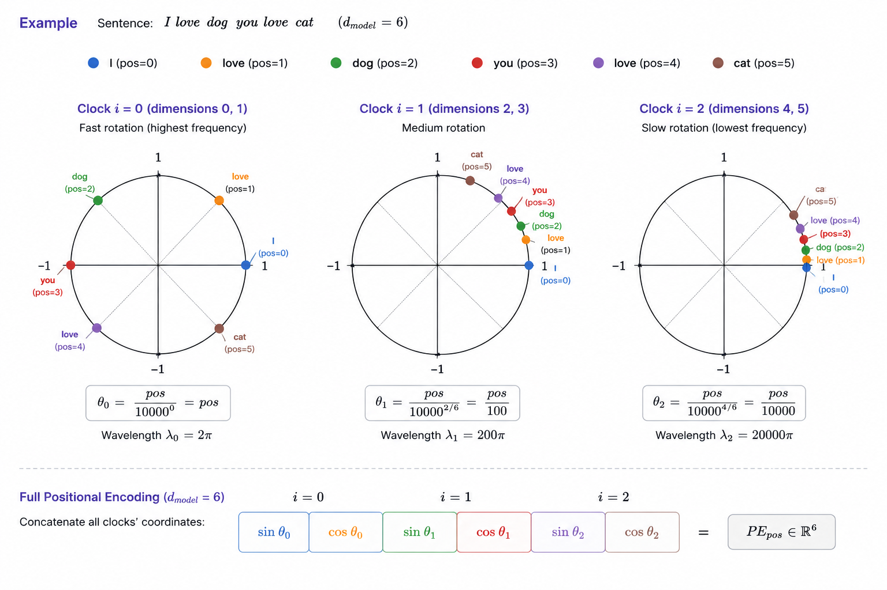

# Transformer Architecture

## Data Flow

Input Tokens → Embedding → Positional Encoding → Encoder * N → E

Output Tokens → Embedding → Positional Encoding → Decoder * N (with E) → Linear Projection → Softmax

## Components

### 1. Positional Encoding

- PE(pos,2i) = sin(pos/10000^(2i/dmodel))
- PE(pos,2i+1) = cos(pos/10000^(2i/dmodel))

Let θ = pos/10000^(2i/dmodel), it is acceptable to understand as (sin(θ), cos(θ)) pair of different frequency clocks.

In this view, high frequency clock (low i) represents local position and low frequency clock (high i) represents global position in sequence.

### 2. Multi-Head Attention

- Attention(Q,K,V) = softmax(QKT / √dk)V
- MultiHead(Q,K,V) = Concat(head1, ..., headh) where headi = Attention(Q,K,V)

Tensor Shape:
| Operation | Before | After |
|---|---|---|
| Input | (batch, seq_len, d_model) | (batch, seq_len, d_model) |
| Q projection | (batch, seq_len, d_model) | (batch, head, seq_len, d_k) |
| K projection | (batch, seq_len, d_model) | (batch, head, seq_len, d_k) |
| V projection | (batch, seq_len, d_model) | (batch, head, seq_len, d_v) |
| Q @ K.T | (batch, head, seq_len, d_k) | (batch, head, seq_len, seq_len) |
| softmax(QKT / √dk)V | (batch, head, seq_len, seq_len) | (batch, head, seq_len, d_v) |
| Concatenate | (batch, head, seq_len, d_v) | (batch, seq_len, d_model) |

Multi

